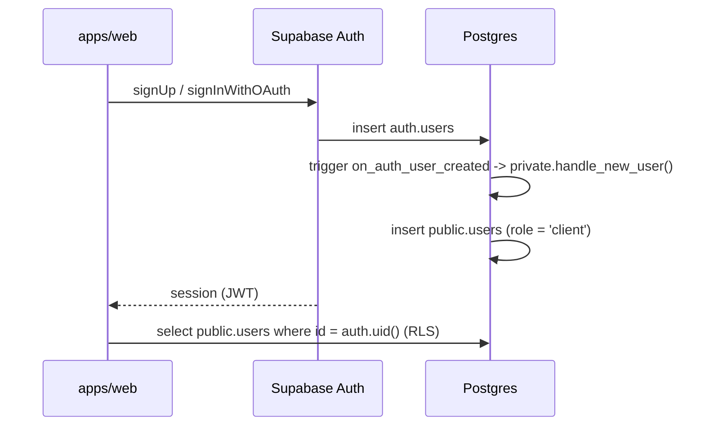

# Supabase Auth

Proyecto: `tico-app` (`ceafdnvkfziidtgxflyw`).
Dashboard: <https://supabase.com/dashboard/project/ceafdnvkfziidtgxflyw/auth/providers>

## Como se vincula Auth con la aplicacion



- `private.handle_new_user()` copia `email`, `full_name`/`name`, `avatar_url`/`picture` y
  `preferred_language` desde `raw_user_meta_data`. **Nunca** copia `role`: el rol global lo
  gestionan los triggers del sistema (crear negocio -> `business_owner`, ser agregado a un
  negocio -> `business_employee`) o el backend con `service_role`.
- Si cambia el email en Auth, `on_auth_user_email_updated` lo sincroniza en `public.users`.
- El usuario solo puede editar `full_name`, `avatar_url` y `preferred_language`
  (privilegios de columna + RLS).

## 1. Email + contrasena (activo por defecto)

Dashboard > Authentication > Providers > Email.

Recomendado en desarrollo:

- **Confirm email**: desactivar para probar sin correo real (reactivar en produccion).
- **Minimum password length**: 8 (coincide con `SignUpSchema`).

Al registrar desde el frontend, envia el nombre en `options.data` para que el trigger lo tome:

```ts
await supabase.auth.signUp({
  email,
  password,
  options: { data: { full_name: fullName, preferred_language: "es" } },
})
```

## 2. URLs de redireccion (accion manual)

Dashboard > Authentication > URL Configuration:

| Campo                   | Valor                                                              |
| ----------------------- | ------------------------------------------------------------------ |
| Site URL                | `http://localhost:5173` (produccion: dominio de Cloudflare Pages)  |
| Additional Redirect URLs| `http://localhost:5173/**`, `https://<dominio-prod>/**`            |

`supabase/config.toml` ya tiene estos valores para el stack local.

## 3. Sign in with Google

Sigue [Sign in with Google](https://supabase.com/docs/guides/auth/social-login/auth-google).
El cliente es una SPA con PKCE (`flowType: "pkce"` en `apps/web/src/lib/supabase.ts`).

En Google Auth Platform:

1. Scopes: `openid` (manual), `.../auth/userinfo.email` y `.../auth/userinfo.profile`.
2. Cliente OAuth de tipo **Web application**.
3. Authorized JavaScript origins: `http://localhost:5173` (y el dominio de produccion).
4. Authorized redirect URI:
   `https://ceafdnvkfziidtgxflyw.supabase.co/auth/v1/callback`
   (local: `http://127.0.0.1:54321/auth/v1/callback`).

En Supabase Dashboard > Authentication > Providers > Google: Client ID, Client Secret y el provider activo.
Esa misma URL de callback debe estar en la lista de redirect del proyecto, y `http://localhost:5173/auth/callback` en Additional Redirect URLs.

Para el stack local, en `supabase/config.toml`:

```toml
[auth.external.google]
enabled = true
client_id = "env(SUPABASE_AUTH_EXTERNAL_GOOGLE_CLIENT_ID)"
secret = "env(SUPABASE_AUTH_EXTERNAL_GOOGLE_CLIENT_SECRET)"
skip_nonce_check = false
```

El boton llama `signInWithOAuth` con `redirectTo` en `/auth/callback`. Esa pagina cambia el `code` por la sesion con `exchangeCodeForSession`. El trigger `handle_new_user` copia `name` y `picture` de Google. El Client ID y el secret no van en el frontend.

## 4. Verificacion

Tras registrar un usuario de prueba:

```sql
select u.id, u.email, u.full_name, u.role
from public.users u
join auth.users a on a.id = u.id
order by u.created_at desc
limit 5;
```

Debe aparecer con `role = 'client'`.

## 5. Seguridad (checklist)

- [x] `service_role` solo en `apps/api` (`SUPABASE_SERVICE_ROLE_KEY`, nunca `VITE_*`).
- [x] Rol global no editable por el usuario (revoke update(role) + trigger sin metadata).
- [x] RLS activo en las 16 tablas; politicas con `to authenticated|anon`.
- [x] Funciones `security definer` en schema `private` (no expuesto), `search_path = ''`.
- [ ] Confirmacion de email activada en produccion.
- [ ] JWT expiry corto y rotacion de refresh tokens revisados antes del release.
