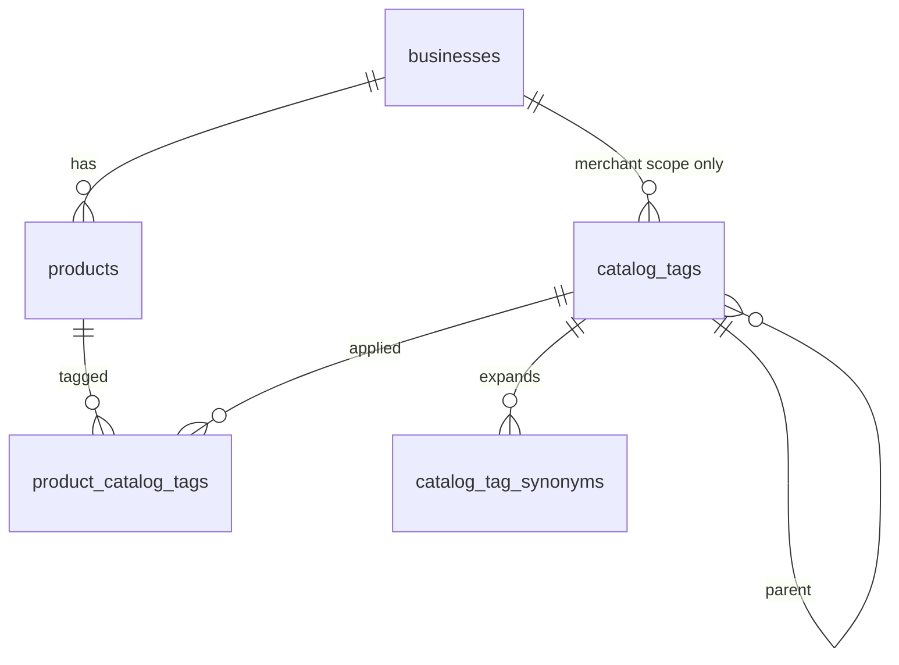

# Catálogo, taxonomía y descubrimiento de locales

Modelo de producción para escalar búsqueda del tipo: *“locales que venden bebidas”* o *“locales con Coca-Cola / Ranchitas”*, con taxonomía en `catalog_tags` / `product_catalog_tags`.

## Principios

1. **Separar rubro del negocio vs etiquetas de producto** — `businesses.category` describe el local (Pulpería, Farmacia). La taxonomía de producto vive en tablas propias.
2. **Dos ámbitos de etiqueta (`scope`)** — marketplace (global, curada) vs merchant (estantería interna del negocio). El descubrimiento público filtra por tags `marketplace`.
3. **Relación N:M** — un producto puede tener varias etiquetas; una etiqueta agrupa muchos productos y, vía productos, muchos negocios.
4. **Búsqueda por nombre en capa SQL dedicada** — MV `business_catalog_search` + RPC `discover_businesses_v2` (geo, provincia, paginación, `matches jsonb`) unificando texto de catálogo, tags y metadatos del negocio. Servicios y menú solo cuentan si el módulo correspondiente está activo.
5. **Tags en productos** — la fuente de verdad es `product_catalog_tags` (marketplace + merchant).

## Diagrama

## Tablas

### `catalog_tags`

Nodo de taxonomía (árbol opcional vía `parent_id`).

| Columna | Notas |
| -------- | ----- |
| `scope` | `marketplace` \| `merchant` |
| `business_id` | NULL si `marketplace`; obligatorio si `merchant` |
| `parent_id` | Jerarquía (ej. Bebidas → Gaseosas) |
| `slug` | Identificador estable (`bebidas`, `snacks`); kebab-case |
| `name` | Etiqueta visible |
| `sort_order`, `is_active` | Orden en UI y soft-off |

Restricciones:

- Un slug global único para `marketplace`.
- Un slug único por negocio para `merchant`.

### `product_catalog_tags`

PK `(product_id, tag_id)`. Índice en `tag_id` para “negocios con este tag”.

### `catalog_tag_synonyms`

Términos alternativos por tag (`gaseosa` → tag Bebidas). Útil para autocompletado y expansión de consultas.

### `products.search_vector`

Columna generada `tsvector` sobre `name` + `description` (config `simple`; evolucionar a `spanish` + `unaccent` si hace falta).

### `business_catalog_search` (MV)

Snapshot indexado del catálogo publicable (productos disponibles; servicios/menú con módulo activo). Se refresca con `refresh_business_catalog_search()` (p. ej. cada 15 min vía `pg_cron`).

## RPC `discover_businesses_v2`

Parámetros principales:

| Parámetro | Uso |
| --------- | --- |
| `q` | Texto libre: producto, servicio, menú, marca o nombre del local |
| `marketplace_tag_slugs` | Filtro OR de slugs marketplace (vía `tag_slugs` en la MV) |
| `matches` | Hasta 5 coincidencias `{ kind, id, label }` por local (`business`, `product`, `service`, `menu`) |
| `categories` | Rubro del **negocio** (compat con home actual) |
| `lat`, `lng`, `radius_km`, `provinces` | Geo y división administrativa |
| cursores | Misma estrategia keyset que `search_businesses` |

Criterio de inclusión (OR dentro de `q`):

- Ítem en la MV cuyo `search_vector` coincide con `q` (`plainto_tsquery`).
- Nombre/categoría del negocio coincide con `q` (descubrimiento híbrido).
- Sinónimos de tags marketplace enlazados a productos del negocio en la MV.

Criterio de tags:

- Existe fila en la MV del negocio con `tag_slugs` que intersecta `marketplace_tag_slugs`.

Ejecución con `security definer` + `search_path = ''`, igual que `search_businesses`; la API usa service role.

## Flujo de datos (merchant)

1. Al crear/editar producto, el cliente envía `marketplaceTagIds[]` y opcionalmente `merchantTagIds[]`. El alta rápida exige al menos un tag marketplace.
2. La API reemplaza filas en `product_catalog_tags` (marketplace y merchant por separado) junto con el producto.
3. Tags `marketplace` solo los asigna admin o lista cerrada en seed; el comercio elige de catálogo global (combobox multi-select contra slugs/ids).
4. Tags `merchant` los crea el negocio (estantería propia); no afectan el filtro global salvo que se mapeen a marketplace (fase posterior: tabla `tag_mappings`).

## Evolución (sin cambiar el modelo)

| Necesidad | Extensión |
| --------- | --------- |
| Más relevancia en ranking | Peso por ventas, distancia, `ts_rank`, patrocinios |
| Catálogo muy grande | `REFRESH CONCURRENTLY` de la MV; radio máximo 50 km en discovery |
| SLA de búsqueda | p95 objetivo 300 ms (`DISCOVERY_P95_SLA_MS`). Si se supera, `DISCOVERY_ENGINE=external` y `DISCOVERY_EXTERNAL_URL`. Pesos: distancia 0.45, texto 0.35, patrocinio 0.20. Si el motor externo falla, la API vuelve a `discover_businesses_v2`. |
| Variantes | `product_variants.sku` entra en `search_vector` de la MV |
| Menú digital | Vista `sellable_items` + `GET /api/businesses/:id/catalog?cursor=`. La sección del menú sigue siendo texto. |

## Migración

- `supabase/migrations/20261001220000_catalog_tags_discovery.sql` — tablas, seed, backfill, RLS.
- `supabase/migrations/20261002100000_discover_catalog_full.sql` — `search_vector` en servicios y menú.
- `supabase/migrations/20261002210000_catalog_scale.sql` — índices parciales, `sellable_items`, `business_catalog_search`, `discover_businesses_v2`.
- `supabase/migrations/20261002230000_drop_discover_businesses_legacy.sql` — elimina RPC `discover_businesses`.
- `supabase/migrations/20261002240000_drop_products_category.sql` — elimina columna `products.category`.

`GET /api/businesses` llama siempre `discover_businesses_v2`. No particionar `products` hasta ~10–50M filas. Los filtros de producto usan slugs/ids de tags. Servicios guardan rubros de `BUSINESS_CATEGORY_OPTIONS`.
