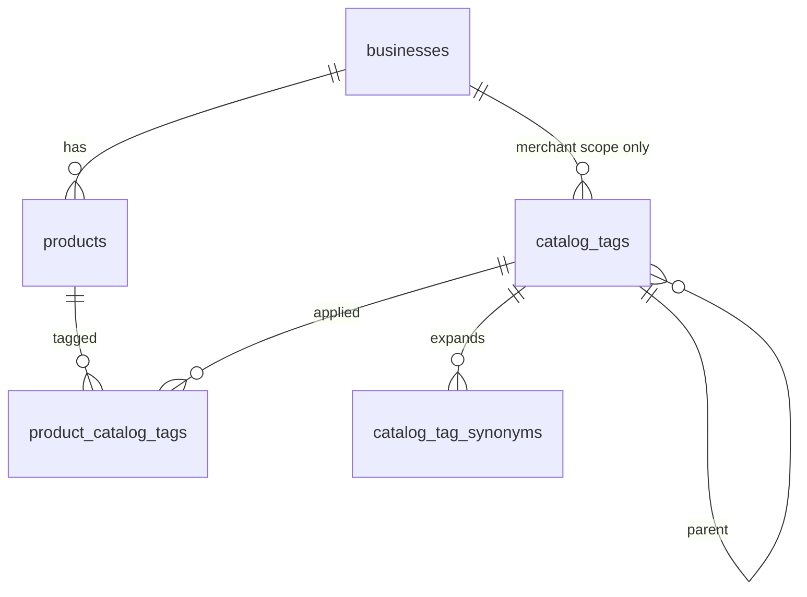

# Catálogo, taxonomía y descubrimiento de locales

Modelo de producción para escalar búsqueda del tipo: *“locales que venden bebidas”* o *“locales con Coca-Cola / Ranchitas”*, sin depender de strings libres en `products.category`.

## Principios

1. **Separar rubro del negocio vs etiquetas de producto** — `businesses.category` describe el local (Pulpería, Farmacia). La taxonomía de producto vive en tablas propias.
2. **Dos ámbitos de etiqueta (`scope`)** — marketplace (global, curada) vs merchant (estantería interna del negocio). El descubrimiento público filtra por tags `marketplace`.
3. **Relación N:M** — un producto puede tener varias etiquetas; una etiqueta agrupa muchos productos y, vía productos, muchos negocios.
4. **Búsqueda por nombre en capa SQL dedicada** — `tsvector` + `pg_trgm` sobre productos, servicios y menú; RPC `discover_businesses` que devuelve negocios (geo, provincia, paginación, `matches jsonb`) unificando texto de catálogo, tags y metadatos del negocio. Servicios y menú solo cuentan si el módulo correspondiente está activo.
5. **`products.category` queda legado** — se mantiene temporalmente para compatibilidad; la fuente de verdad pasa a `product_catalog_tags`. No usar CSV como modelo a largo plazo.

## Diagrama

## Tablas

### `catalog_tags`

Nodo de taxonomía (árbol opcional vía `parent_id`).

| Columna | Notas |
| -------- | ----- |
| `scope` | `marketplace` \| `merchant` |
| `business_id` | NULL si `marketplace`; obligatorio si `merchant` |
| `parent_id` | Jerarquía (ej. Bebidas → Gaseosas) |
| `slug` | Identificador estable (`bebidas`, `snacks`); kebab-case |
| `name` | Etiqueta visible |
| `sort_order`, `is_active` | Orden en UI y soft-off |

Restricciones:

- Un slug global único para `marketplace`.
- Un slug único por negocio para `merchant`.

### `product_catalog_tags`

PK `(product_id, tag_id)`. Índice en `tag_id` para “negocios con este tag”.

### `catalog_tag_synonyms`

Términos alternativos por tag (`gaseosa` → tag Bebidas). Útil para autocompletado y expansión de consultas.

### `products.search_vector`

Columna generada `tsvector` sobre `name` + `description` (config `simple`; evolucionar a `spanish` + `unaccent` si hace falta).

## RPC `discover_businesses`

Parámetros principales:

| Parámetro | Uso |
| --------- | --- |
| `q` | Texto libre: producto, servicio, menú, marca o nombre del local |
| `marketplace_tag_slugs` | Filtro OR de slugs marketplace |
| `matches` | Hasta 5 coincidencias `{ kind, id, label }` por local (`business`, `product`, `service`, `menu`) |
| `categories` | Rubro del **negocio** (compat con home actual) |
| `lat`, `lng`, `radius_km`, `provinces` | Geo y división administrativa |
| cursores | Misma estrategia keyset que `search_businesses` |

Criterio de inclusión (OR dentro de `q`):

- Producto disponible cuyo `search_vector` o trigram coincide con `q`.
- Servicio activo (módulo `services`) o ítem de menú disponible (módulo `menu`) con el mismo criterio.
- Nombre/categoría del negocio coincide con `q` (descubrimiento híbrido).

Criterio de tags:

- Existe producto disponible del negocio enlazado a algún `catalog_tags.slug` en `marketplace_tag_slugs`.

Ejecución con `security definer` + `search_path = ''`, igual que `search_businesses`; la API usa service role.

## Flujo de datos (merchant)

1. Al crear/editar producto, el cliente envía `marketplaceTagIds[]` y opcionalmente `merchantTagIds[]`.
2. La API reemplaza filas en `product_catalog_tags` en transacción con el producto.
3. Tags `marketplace` solo los asigna admin o lista cerrada en seed; el comercio elige de catálogo global (combobox multi-select contra slugs/ids).
4. Tags `merchant` los crea el negocio (estantería propia); no afectan el filtro global salvo que se mapeen a marketplace (fase posterior: tabla `tag_mappings`).

## Evolución (sin cambiar el modelo)

| Necesidad | Extensión |
| --------- | --------- |
| Más relevancia en ranking | Peso por ventas, distancia, `ts_rank`, patrocinios |
| Millones de SKUs | MV `business_catalog_search` refrescada; luego motor externo alimentado desde Postgres |
| Variantes | Incluir `product_variants.sku` en documento de búsqueda |
| Menú digital | Misma taxonomía en `menus` o vista unificada `sellable_items` |

## Migración

- `supabase/migrations/20261001220000_catalog_tags_discovery.sql` — tablas, seed, backfill, RLS y primera RPC.
- `supabase/migrations/20261002100000_discover_catalog_full.sql` — `search_vector` en servicios y menú, y `discover_businesses` con `matches`.

`GET /api/businesses` llama `discover_businesses`. `GET /api/catalog/marketplace-tags` lista la taxonomía global. Los productos guardan `marketplaceTagIds` en `product_catalog_tags`.
