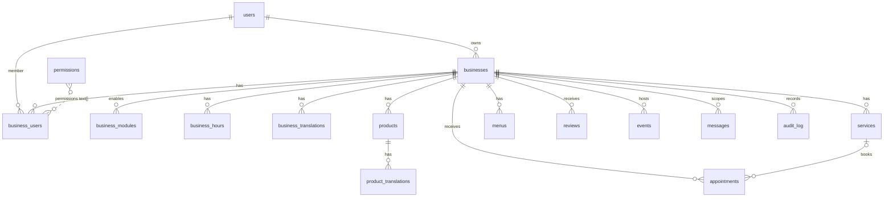

# Modelo de datos

Proyecto Supabase `tico-app` (Postgres 17 + PostGIS). Fuente de verdad: `supabase/migrations/`.

| Migracion                                   | Contenido                                                     |
| ------------------------------------------- | ------------------------------------------------------------- |
| `20260924200001_extensions_and_private_schema` | PostGIS, schema `private`, `set_updated_at()`               |
| `20260924200002_core_tables`                | 16 tablas, indices, triggers, helpers de autorizacion         |
| `20260924200003_rls_policies`               | RLS en las 16 tablas + privilegios de columna                 |
| `20260924200004_seed_permissions`           | Catalogo de 32 permisos                                       |
| `20260924200005_rls_consolidate_policies`   | Una sola politica SELECT por rol (advisor de performance)     |

## Diagrama

## Convenciones

- PK `uuid default gen_random_uuid()`; FKs siempre indexadas.
- `text` en vez de `varchar`, `timestamptz` en vez de `timestamp`, `numeric(12,2)` para dinero.
- Enumeraciones como `text` + `check` (roles, modulos, estados) para evolucionar sin `alter type`.
- `created_at`/`updated_at` con trigger `private.set_updated_at()`.
- `created_by uuid default auth.uid()` en entidades de modulos: soporta permisos `*_edit_own`/`*_delete_own`.
- Traducciones en tablas `*_translations` con `unique(entidad_id, language_code)`.

## Tablas

### 1. `users`
Perfil publico 1:1 con `auth.users` (creado por trigger).

| Columna              | Tipo        | Notas                                                          |
| -------------------- | ----------- | -------------------------------------------------------------- |
| id                   | uuid PK     | FK `auth.users.id` on delete cascade                           |
| email                | text unique |                                                                |
| full_name, avatar_url| text        |                                                                |
| role                 | text        | `admin` \| `business_owner` \| `business_employee` \| `client` (default) |
| preferred_language   | text        | `^[a-z]{2}(-[A-Z]{2})?$`, default `es`                          |

### 2. `businesses`
| Columna                | Tipo                       | Notas                                             |
| ---------------------- | -------------------------- | ------------------------------------------------- |
| owner_id               | uuid FK users              |                                                   |
| name, category         | text                       | 1-120 / 1-60 chars                                |
| latitude, longitude    | double precision           | ambos null o ambos presentes                      |
| location               | geography(Point,4326)      | **generado** desde lat/long; indice GIST          |
| address, whatsapp_number, website, email, phone, logo_url, banner_url | text |                          |
| is_active              | boolean default true       | negocios inactivos solo visibles para miembros    |
| chat_retention_days    | int default 30             | 1..30 (PDF seccion 6)                             |

Busqueda por radio: `st_dwithin(location, st_setsrid(st_makepoint(lng, lat), 4326)::geography, radio_m)`.

### 3. `business_modules`
`business_id`, `module_name` (`products|services|menu|appointments`), `enabled`. Unique por negocio y modulo.

### 4. `permissions`
Catalogo `name` (`modulo:accion`, unique), `module`, `action`, `description`. 32 filas (ver seed).

### 5. `business_users`
`business_id`, `user_id`, `role` (`owner|manager|employee`), `permissions text[]`. Unique (business, user).
Trigger `on_business_user_change` valida cada permiso contra el catalogo y promueve el rol global del usuario.

### 6. `products`
`business_id`, `name`, `description`, `price numeric(12,2)`, `stock int`, `image_url`, `category`, `is_available`, `created_by`.

### 7. `product_translations`
`product_id`, `language_code`, `name`, `description`. Unique (product, language).

### 8. `messages`
`sender_id`, `receiver_id`, `business_id`, `text` (1-4000), `is_read`. `sender <> receiver`.
Indices: `(business_id, created_at desc)`, sender, receiver, parcial de no leidos.

### 9. `audit_log`
`business_id`, `user_id` (nullable, `on delete set null`), `action`, `entity_type`, `entity_id`, `changes jsonb`. Inmutable desde el cliente.

### 10. `business_hours`
Horario semanal (`day_of_week` 0=domingo..6) **o** excepcion por fecha (`exception_date`), nunca ambos.
`open_time`/`close_time` requeridos salvo `is_closed`. Unicos parciales por (negocio, dia) y (negocio, fecha).

### 11. `services`
`business_id`, `name`, `description`, `price` (nullable), `duration_minutes`, `category`, `image_url`, `is_active`, `created_by`.

### 12. `menus`
Una fila por item del menu digital: `business_id`, `section`, `name`, `description`, `price`, `image_url`, `is_available`, `sort_order`, `created_by`.

### 13. `appointments`
`business_id`, `client_id`, `service_id` (nullable), `employee_id` (nullable), `scheduled_at`, `duration_minutes`, `status` (`pending|confirmed|cancelled|completed`), `notes`.

### 14. `reviews`
`business_id`, `user_id`, `rating` 1..5, `comment` (<= 2000). Una resena por usuario y negocio.

### 15. `events`
`business_id`, `title`, `description`, `starts_at`, `ends_at` (> starts_at), `location_text`, `image_url`, `rsvp_enabled`, `whatsapp_enabled`, `created_by`.

### 16. `business_translations`
`business_id`, `language_code`, `name`, `description`. Unique (business, language).

## Funciones (`private`, SECURITY DEFINER, `search_path = ''`)

El schema `private` no esta expuesto por la Data API. Las funciones verifican siempre `auth.uid()`.

| Funcion                                        | Devuelve true si...                                           |
| ---------------------------------------------- | ------------------------------------------------------------- |
| `is_admin()`                                   | `users.role = 'admin'` para el usuario actual                 |
| `is_business_owner(business_id)`               | el usuario actual es `businesses.owner_id`                    |
| `is_user_business_member(business_id, user_id)`| `user_id` es dueno o esta en `business_users`                 |
| `is_business_member(business_id)`              | admin, dueno o miembro (usuario actual)                       |
| `has_permission(business_id, 'mod:accion')`    | admin, dueno, o miembro cuyo `permissions` contiene el permiso |

Triggers:

| Trigger                       | Tabla            | Efecto                                                                 |
| ----------------------------- | ---------------- | ---------------------------------------------------------------------- |
| `on_auth_user_created`        | auth.users       | crea `public.users` (rol `client`, nunca desde metadata)               |
| `on_auth_user_email_updated`  | auth.users       | sincroniza email                                                       |
| `on_business_created`         | businesses       | inserta membresia `owner`; `client` -> `business_owner`                |
| `on_business_user_change`     | business_users   | valida permisos; `client` -> `business_employee`                       |
| `set_*_updated_at`            | varias           | `updated_at = now()`                                                   |

## Politicas RLS (resumen)

| Tabla                 | SELECT                                            | INSERT                                  | UPDATE                                     | DELETE                               |
| --------------------- | ------------------------------------------------- | --------------------------------------- | ------------------------------------------ | ------------------------------------ |
| users                 | propio, admin, co-miembros, contrapartes de chat  | (trigger)                               | propio; solo full_name/avatar_url/preferred_language | (cascade desde auth)         |
| businesses            | anon: activos; auth: activos o miembro            | `owner_id = uid`                        | `business:edit` (owner_id no editable)     | dueno o admin                        |
| business_modules      | publico                                           | `business:edit`                         | `business:edit`                            | `business:edit`                      |
| permissions           | authenticated                                     | admin                                   | admin                                      | admin                                |
| business_users        | propio o miembro del negocio                      | `employees:manage`, rol <> owner        | `employees:manage`, rol <> owner           | `employees:manage`, rol <> owner     |
| products / services / menus | publico                                     | `X:create` y `created_by = uid`         | `X:edit_all` o (`X:edit_own` y propio)     | `X:delete_all` o (`X:delete_own` y propio) |
| product_translations  | publico                                           | `products:edit_all`                     | `products:edit_all`                        | `products:edit_all`                  |
| messages              | emisor, receptor o `chat:view_all`                | `sender_id = uid`, alguna parte es miembro | receptor, solo `is_read`                | (backend por retencion)              |
| audit_log             | `audit:view`                                      | miembro, `user_id = uid`                | no                                         | no                                   |
| business_hours        | publico                                           | `hours:edit`                            | `hours:edit`                               | `hours:edit`                         |
| appointments          | cliente, empleado asignado o `appointments:view`  | cliente propio o `appointments:create`  | cliente, `edit_all`, o empleado con `edit_own` | `delete_all` o empleado con `delete_own` |
| reviews               | publico                                           | `user_id = uid`                         | autor                                      | autor o admin                        |
| events                | publico                                           | `events:manage` y `created_by = uid`    | `events:manage`                            | `events:manage`                      |
| business_translations | publico                                           | `business:edit`                         | `business:edit`                            | `business:edit`                      |

El backend (`service_role`) bypassa RLS para tareas del sistema (bitacora automatica, retencion de chat, admin).

## Catalogo de permisos

Por modulo (`products`, `services`, `menu`, `appointments`): `view`, `create`, `edit_own`, `edit_all`, `delete_own`, `delete_all`.
Adicionales: `business:edit`, `employees:manage`, `chat:view_all`, `audit:view`, `gallery:upload`, `events:manage`, `hours:edit`, `reviews:respond`.

Fuente de verdad en TypeScript: `PERMISSION_DEFINITIONS` en `packages/shared/src/constants.ts`.
El test `packages/shared/src/__tests__/constants.test.ts` verifica que coincide con el seed SQL.

## Desviaciones respecto al prompt inicial

| Prompt                                   | Implementado                                  | Motivo                                              |
| ---------------------------------------- | --------------------------------------------- | --------------------------------------------------- |
| `VARCHAR`, `TIMESTAMP`, `DECIMAL`         | `text`, `timestamptz`, `numeric(12,2)`        | Best practices Postgres (zona horaria, precision)   |
| `ll_to_earth` + GIST                     | PostGIS `geography` generada + GIST           | El PDF especifica PostGIS; soporta `ST_DWithin`     |
| `businesses.latitude DECIMAL`            | `double precision` + check de rango           | Tipo nativo de coordenadas en PostGIS               |
| `audit_log.user_id NOT NULL`             | nullable, `on delete set null`                | Conservar la bitacora si se elimina el usuario      |
| Sin `created_by`                         | `created_by` en products/services/menus/events| Necesario para permisos `*_own`                     |
| Sin retencion de chat                    | `businesses.chat_retention_days` (1..30)      | PDF seccion 6                                       |
| `business_hours` solo semanal            | `exception_date` + checks                     | PDF seccion 13 (horarios con excepciones)           |
| `users` sin idioma                       | `preferred_language`                          | Multi-idioma (PDF seccion 8)                        |
| RLS `USING (auth.uid() = id)`            | `(select auth.uid())`, `to authenticated`     | Rendimiento y seguridad (evita `auth.role()`)       |
| `API_BASE_URL` en shared                 | env por app (`apps/api/src/config/env.ts`, `apps/web/src/lib/env.ts`) | `process.env` no existe en el navegador |
